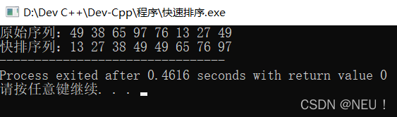

## 概述：
> 快速排序是对冒泡排序的一种改进。基本思想是：通过一趟排序将待排记录分割成独立的两部分，其中一部分记录的关键字均比另一部分记录的关键字小，则可分别对这两部分记录继续进行排序，以达到整个序列有序。

> 首先用数组的第一个数作为枢轴，然后将所有比它小的数都放到它的位置之前，所有比它大的数都放到它的位置之后，由此可以该“枢轴“记录最后所落的位置i作为分界线，将序列分割成两个子序列。这个过程称为一趟快速排序。

> 一趟快速排序的算法是：
>
> ​设置两个变量i、j，排序开始的时候：令i=0，j=length-1；
>
>​以第一个数组元素作为枢轴，赋值给key，即key=array[0]；
>
>​从j开始向前扫描，找到第一个小于key的值array[j]，将array[j]和array[i]的值交换；
>
>​从i开始向后扫描，找到第一个大于key的值array[i]，将array[i]和array[j]的值交换；
>
>重复第3、4步，直到i==j，将枢轴元素移到正确位置上，即将key赋值给array[i]。

**时间复杂度：通常，快速排序被认为是，在所有同数量级(O(nlogn))的排序方法中，其平均性能最好。但是，若初始记录序列按关键字有序或基本有序时，快速排序将蜕化为冒泡排序，其时间复杂度为O(n²)。**

<font color=Red>最坏：O(n²)</font><br/>
<font color=Red>最好和平均：O(nlogn)</font><br/>

## 代码如下：
``` java
//快速排序
#include <iostream> 
using namespace std;
void QuickSort(int *array,int low,int high){	//快排 
	if(low>=high){	//若待排序序列只有一个元素，返回空 
		return ;
	}
	int i=low;	//i作为指针从左向右扫描 
	int j=high;	//j作为指针从右向左扫描
	int key=array[low];//第一个数作为基准数 
	while(i<j){
		while(array[j]>=key&&i<j){	//从右边找小于基准数的元素 （此处由于j值可能会变，所以仍需判断i是否小于j） 
			j--;	//找不到则j减一 
		}
		array[i]=array[j];	//找到则赋值 
		while(array[i]<=key&&i<j){	//从左边找大于基准数的元素 
			i++;	//找不到则i加一 
		}
		array[j]=array[i];	//找到则赋值 
	}
	array[i]=key;	//当i和j相遇，将基准元素赋值到指针i处 
	QuickSort(array,low,i-1);	//i左边的序列继续递归调用快排 
	QuickSort(array,i+1,high);	//i右边的序列继续递归调用快排 
}
int main(){
	int array[]={49,38,65,97,76,13,27,49};
	int length=sizeof(array)/sizeof(*array);
	cout<<"原始序列：";
	for(int i=0;i<length;i++){
		cout<<array[i]<<" ";
	}
	cout<<endl;
	QuickSort(array,0,length-1);
	cout<<"快排序列：";
	for(int i=0;i<length;i++){
		cout<<array[i]<<" ";
	}
	return 0;
}
```

## 运行截图如下：
​​​​​​ 

## **参考我的博客地址：** [点一下这里，嘻嘻......](https://blog.csdn.net/weixin_59566851/article/details/122097368 "NEU!")