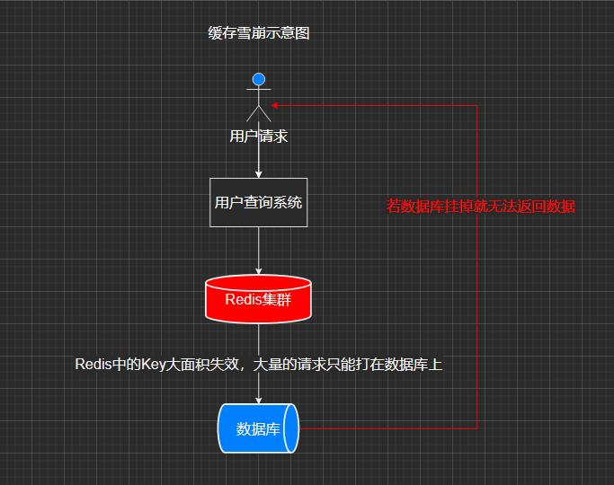
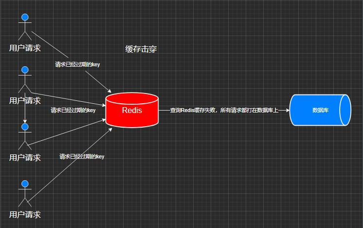
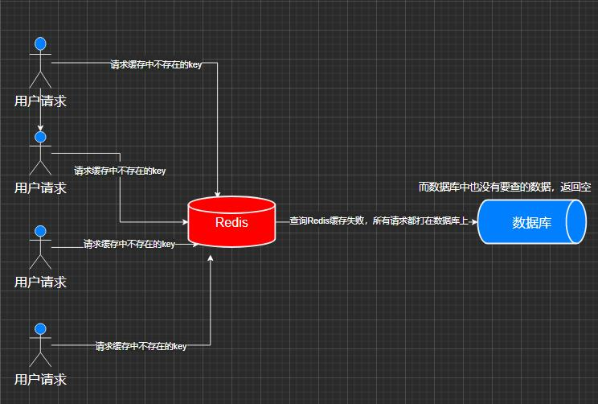

## 一、Redis是什么
Redis（Remote Dictionary Server）是现在最受欢迎的NoSQL数据库之一，是一个**基于内存**实现的**键值型非关系数据库**，且开源免费。  
（具体使用方法及应用场景不再赘述）

## 二、缓存雪崩、缓存击穿、缓存穿透的区别及解决方案
使用缓存需要考虑这几个问题
### 1、缓存雪崩（Cache Avalanche）
当Redis中<font color=Red>某时刻发生大面积的缓存失效（即redis中的key过期）</font>，那么就会导致大量的用户请求直接打在数据库上面，导致数据库压力剧增。若在高并发场景下，数据库服务瞬间就会挂掉。

​​​​​​   
#### 原因：
可以发现根本原因是<font color=Red>同一时间大规模的key失效</font>，是因为大量的Key在同一时间过期（**设置缓存时采用了相同的过期时间**，导致缓存在某一时刻同时失效），再就是有可能Redis服务挂掉了。
#### 解决方案：
##### （1）、过期时间打散：
既然是大量缓存集中失效，那最容易想到就是让他们不集中生效。可以给缓存的过期时间时加上一个随机值时间，使得每个 key 的过期时间分布开来，不会集中在同一时刻失效。
##### （2）、热点数据不过期：
该方式和缓存击穿一样，也是要着重考虑刷新的时间间隔和数据异常如何处理的情况。
##### （3）、加互斥锁: 
该方式和缓存击穿一样，按 key 维度加锁，对于同一个 key，只允许一个线程去计算，其他线程原地阻塞等待第一个线程的计算结果，然后直接走缓存即可。
##### （4）、采用熔断机制:
流量到达一定峰值时，直接返回系统繁忙。   

*java中可以加锁排队：*
``` java
 public Object GetProductListNew(String cacheKey) {
        int cacheTime = 30;
        String lockKey = cacheKey; 
        // 获取key的缓存
        String cacheValue = jedis.get(cacheKey); 
        // 缓存未失效返回缓存
        if (cacheValue != null) {
            return cacheValue;
        } else { 
            // 枷锁
            synchronized (lockKey) { 
                // 获取key的value值
                cacheValue = jedis.get(cacheKey);
                if (cacheValue != null) {
                    return cacheValue;
                } else { 
                    // 这里一般是sql查询数据 
                    // db.set(key) 
                    // 添加缓存
                    jedis.set(cacheKey, "");
                }
            }
            return cacheValue;
        }
    }
```
### 2、缓存击穿（Cache Breakdown）
**某一个热点 Key**在缓存过期的一瞬间,同时有大量的请求打进来，由于此时缓存过期了，所以请求最终都会走到数据库，造成数据库压力瞬间剧增，极有可能可能使数据库服务挂掉。  
​​​​​​   
#### 解决方案：
和缓存雪崩类似，缓存雪崩是大规模的key失效，而缓存击穿是一个热点的Key失效。
##### （1）、 互斥锁：
在并发的多个请求中，只有第一个请求线程能拿到锁并执行数据库查询操作，其他的线程拿不到锁就阻塞等着，等到第一个线程将数据写入缓存后，其他线程直接查询缓存。
##### （2）、 热点数据不过期：
直接将缓存设置为不过期，然后由定时任务去异步加载数据，更新缓存。

*java中的代码实现：*
``` java
public String get(String key) throws InterruptedException {
        String value = jedis.get(key);
        // 缓存过期
        if (value == null) {
            // 设置3分钟超时，防止删除操作失败的时候 下一次缓存不能load db
            Long setnx = jedis.setnx(key + "mutex", "1");
            jedis.pexpire(key + "mutex", 3 * 60);
            // 代表设置成功
            if (setnx == 1) {
                // 数据库查询
                // value = db.get(key);
                // 保存缓存
                jedis.setex(key, 3 * 60, "");
                jedis.del(key + "mutex");
                return value;
            } else {
                // 这个时候代表同时操作的其他线程已经load db并设置缓存了。 需要重新重新获取缓存
                Thread.sleep(50);
                // 重试
                return get(key);
            }
        } else {
            return value;
        }
    }
```
### 3、缓存穿透（Cache Penetration）
缓存穿透是指缓存和数据库中都没有的数据<font color=Red>查询一个一定不存在的数据</font>，而用户不断发起请求，比如发起的请求都不合理，每次请求都会到数据库。这时的用户很可能是攻击者，攻击会导致数据库压力过大。
​​​​​​  
#### 分析：
用户查询数据，在数据库没有，自然在缓存中也不会有。这样就导致用户查询的时候，在缓存中找不到，每次都要去数据库再查询一遍，然后返回空（相当于进行了两次无用的查询）。这样请求就绕过缓存直接查数据库，这也是经常提的缓存命中率问题。
#### 解决方案：
##### （1）、对空值缓存：
如果一个查询返回的数据为空（不管数据是否存在），我们仍然把这个空结果缓存，设置空结果的过期时间会很短，最长不超过5分钟。（存在一定问题）
##### （2）、布隆过滤器：
如果想判断一个元素是不是在一个集合里，一般想到的是将集合中所有元素保存起来，然后通过比较确定。  
布隆过滤器是一种数据结构，可以高效的插入和查询。

*java中的代码实现：*
``` xml
<dependency> 
    <groupId>cn.hutool</groupId> 
    <artifactId>hutool-all</artifactId> 
    <version>5.7.17</version> 
</dependency>
```
``` java
// 构造方法的参数10决定了布隆过滤器BitMap的大小 
public void bulong{
    BitMapBloomFilter filter = new BitMapBloomFilter(10); 
    filter.add("123"); 
    filter.add("abc"); 
    filter.add("ddd"); 
    boolean abc = filter.contains("abc");
    System.out.println(abc);
}
```
**日常开发中使用Redis一定要考虑周到,不过Redis在众多NoSQL中还是非常好用的**
​​​​​​    

END...