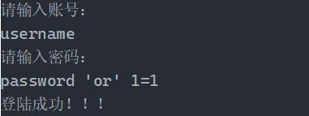
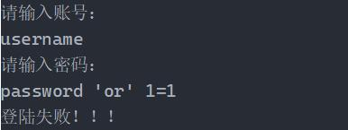

## 一、记录一下SQL注入
哈哈，SQL注入攻击好像挺流行的，用大白话解释一下，SQL注入就是利用有些系统没有对用户输入的数据进行充分的检查这一漏洞，**在用户输入数据中注入非法的SQL语句片段或者命令**，从而利用系统的SQL引擎做出恶意行为的做法。

### 下面贴一个栗子：
**使用Statement实现查询操作：**
``` java
public static List<Account> queryAccounts(String sql) throws Exception {
        List<Account> accounts = new ArrayList<>();
        Connection conn = JDBCUtils.getConnection();
        Statement statement = conn.createStatement();
        // 执行查询操作
        ResultSet rs = statement.executeQuery(sql);
        // 获取元数据
        ResultSetMetaData rsmd = rs.getMetaData();
        // 获取列数
        while (rs.next()) {
            // 将每一行数据通过反射方式赋给Account对象（成员变量）
            Account account = new Account();
            // 通过反射赋值，先将所有的列拿出来
            for (int i = 0; i < rsmd.getColumnCount(); i++) {
                // 再根据列的索引来获取每一列的值
                Object columnValue = rs.getObject(i + 1);
                String columnName = rsmd.getColumnName(i + 1);
                // 获取Account的属性信息
                Field f = account.getClass().getDeclaredField(columnName);
                // 提升权限
                f.setAccessible(true);
                // 注入列值
                f.set(account, columnValue);
            }
            accounts.add(account);
        }
        rs.close();
        JDBCUtils.close(conn, statement);
        return accounts;
    }
```
**执行用户登录的代码：**
``` java
public static boolean login(Map<String, String> userLoginInfo) throws Exception {
        // 定义sql，拼接参数
        String sql = "select * from account where useraccount='" + userLoginInfo.get("account")
                + "' and userpassword = '" + userLoginInfo.get("password") + "'";
        List<Account> accounts = queryAccounts(sql);
        if (accounts.size() == 0) {
            return false;
        }
        return true;
    }
```
**此时登录输入用户名和密码：**      

​​​​​​    
以上输入的账号和密码，通过SQL拼接，在执行过程中的SQL实际上是：
```sql
select * from account where useraccount = 'username' and userpassword = 'password' or '1=1'
```
由于1=1永远成立，所以不管账号密码是否正确，都会返回登陆成功。

## 二、导致SQL注入的根本原因
可以发现，用户输入的信息中包含SQL语句的关键字，<font color=Red>且这些关键字参与了SQL语句的编译过程</font>，导致SQL语句的原意更改，从而达到SQL注入的目的。

## 三、SQL注入解决方案
只要用户提供的信息不参与SQL语句的编译过程，即使用户提供的信息中包含SQL语句的关键字，但是没有参与编译，所以不会起作用。
使用预编译，PreparedStatement可以将信息参数化。

**使用PreparedStatement实现查询操作：**
``` java
public static List<Account> queryAccounts(String sql, Object... args) throws Exception {
        List<Account> accounts = new ArrayList<>();
        Connection conn = JDBCUtils.getConnection();
        PreparedStatement ps = conn.prepareStatement(sql);
        // 预处理之后对sql语句中的占位符进行替换
        for (int i = 0; i < args.length; i++) {
            ps.setObject(i + 1, args[i]);
        }
        // 执行查询操作
        ResultSet rs = ps.executeQuery();
        // 获取元数据
        ResultSetMetaData rsmd = rs.getMetaData();
        // 获取列数
        while (rs.next()) {
            // 将每一行数据通过反射方式赋给Account对象（成员变量）
            Account account = new Account();
            // 通过反射赋值，先将所有的列拿出来
            for (int i = 0; i < rsmd.getColumnCount(); i++) {
                // 再根据列的索引来获取每一列的值
                Object columnValue = rs.getObject(i + 1);
                String columnName = rsmd.getColumnName(i + 1);
                // 获取Account的属性信息
                Field f = account.getClass().getDeclaredField(columnName);
                // 提升权限
                f.setAccessible(true);
                // 注入列值
                f.set(account, columnValue);
            }
            accounts.add(account);
        }
        return accounts;
    }
```

**执行用户登录的代码：**
``` java
public static boolean login(Map<String, String> userLoginInfo) throws Exception {
        String sql = "select * from account where useraccount=? and userpassword = ?";
        List<Account> accounts = queryAccounts(sql, userLoginInfo.get("account"), userLoginInfo.get("password"));
        if (accounts.size() == 0) {
            return false;
        }
        return true;
    }
```
**此时登录输入用户名和密码：**      

​​​​​​ 

以上输入的账号和密码，通过PreparedStatement预编译，将password'or'1=1作为一个整体的字符串参数设置到SQL当中，在执行过程中的SQL实际上是：

``` sql
select * from account where useraccount = 'zhangsan' and userpassword = "password'or'1=1"
```

Prestatement 和statement的区别？   
**Prestatement 对批量处理可以提高效率，statement 每次执行SQL语句都要进行编译**

## 四、参数预编译方式防止sql注入的原理
<font color=Red>在使用参数化查询的情况下，数据库系统不会将参数的内容视为SQL指令的一部分处理，而是在数据库完成SQL指令的编译后才加上参数运行，因此就算参数中含有破坏性的指令，也不会被数据库所运行。</font>对于参数化查询来说，SQL语句的格式是已经规定好了，用户能提供的只是数据，而且只能按照需求提供，无法进一步做出影响数据库的其他操作。

## 五、Web开发中mybatis框架环境下最容易出现sql注入的场景
### 1、模糊查询
通过采用预编译机制，避免SQL语句拼接的问题，防止SQL注入漏洞产生。
### 2、order by之后的参数
### 3、其他的有待研究

## 六、在开发阶段避免SQL注入
参数预编译、用正则表达式过滤传入的参数。   
<font color=Red>此处可以渗透？？（没研究明白，以后再说吧）</font>

用SQL注入漏洞扫描工具。

先会攻击、后会防御 -_-

END...

