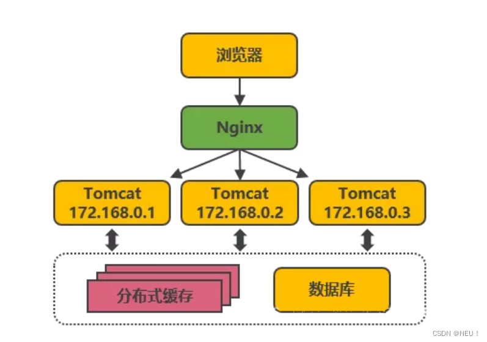
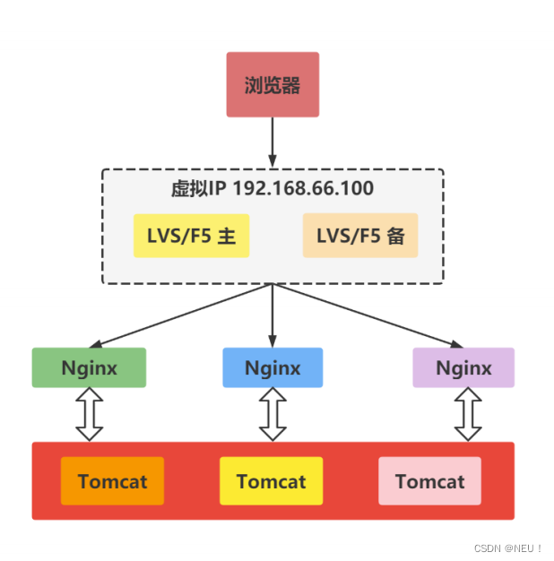
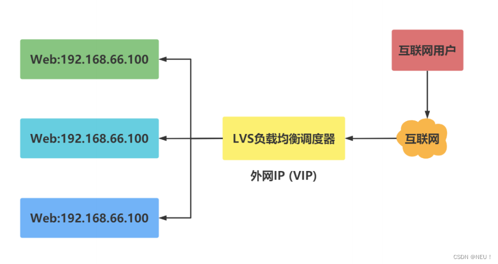
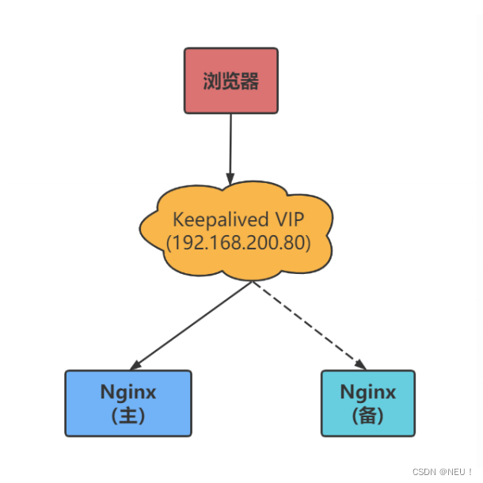

## 一、Nginx高可用
首先了解一下什么是高可用，高可用是分布式系统架构中必须考虑的因素。

我们都知道，**使用nginx的反向代理和负载均衡可以解决tomcat等web容器的单点故障以及高并发等问题**。

反向代理是指以代理服务器来接收浏览器的请求，然后再将请求转发到内网的服务器，然后再将从服务器上得到的结果返回给客户端。负载均衡就是要解决一个web服务器压力过大的问题，此时可以通过多个web服务器根据不同的算法将并发过来的请求分配到多个服务器上，从而减轻单个服务器压力过大的问题。

这样的话，当一台web服务器挂掉了，还有其他的服务器可以处理客户端的请求，也解决了单点故障问题，这是对web服务器的高可用。  
​​​​​​  
但是，上述架构仍然存在单点故障问题吗，**如果这台Nginx挂了，那么所有对外提供的接口都将导致无法访问，所以我们也需要给Nginx配置高可用机制**。   

可以使用keepalived来实现Nginx的高可用。  

## 二、Nginx双机热备
双机热备方案是目前使用最为普遍的一种高可用方案，双机热备就是指一台服务器整在提供服务，另外一台作为备用状态，当一台服务器挂掉之后另外一台就会代替他继续提供服务。

**双机热备主要解决的是Nginx的单点故障问题**。  
​​​​​​   

## 三、LVS负载均衡
再来了解一下LVS，LVS（Linux Vritual Server）即Linux虚拟服务器，他是一个开源的软件，可以实现传输层四层负载均衡，通过 LVS 达到的负载均衡技术可以实现一个高性能高可用的 Linux 服务器集群。

大概流程就是：当客户端发出请求时，会先连接到互联网的DNS服务器，然后解析到LVS负载均衡调度器上，**LVS可以帮我们虚拟出来一个IP地址（外网IP）**，此时客户端用户就会去连接这个虚拟出来的IP，当用户连接到虚拟IP之后LVS会根据指定的调度算法确定具体要连接到哪一台Nginx服务器上。客户端连接到虚拟IP的过程对用户是透明的，而LVS具体连接到哪一台Nginx服务器对用户来说是不知道的。

LVS负载均衡调度器仅仅只是一个调度器，并不是真正的服务。  
  

## 四、keepalived健康监测  

来了解了解为什么要引入keepalived

LVS可以实现负载均衡，但是不能够进行健康检查。意思就是，假如一台Nginx服务器挂掉了，LVS仍然会把客户端的请求发送到这个挂掉了Nginx上（因为LVS并不知道此Nginx挂了），这样就会导致请求无效无法处理客户端的请求。

**keepalive 软件可以进行健康检查**，所以我们需要使用他来进行监测，而且可以实现Nginx的高可用性，解决Nginx的单点故障问题及LVS不能进行健康检查的问题。

**keepalived的工作原理**
keepalived是基于VRRP协议实现的保证集群高可用的一个服务软件，**主要功能是实现真机的故障隔离和负载均衡器间的失败切换，防止单点故障**。VRRP协议保证当主机的下一路由器出现故障时，由另外一台路由器来代替出现故障的路由器进行工作，从而保持网络通信的连续性和可靠性。

**VRRP虚拟出来的是路由**。  

## 五、开始搭建Nginx高可用集群  

1、首先准备两台Nginx服务器，一个作为主服务器MASTER，一个作为备服务器BACKUP，再利用LVS虚拟出来一个IP地址。  
``` shell
#搭建keepalived环境
yum install -y  keepalived
 
#keepalived的启动与停止
service keepalived start
service keepalived stop
```  

2、修改主Nginx服务器keepalived文件：vim  /etc/keepalived/keepalived.conf  
**设置自己的主Nginx服务器的IP地址等信息**，我这里是192.168.66.100，虚拟IP设置为192.168.66.99
``` shell
! Configuration File for keepalived
vrrp_script chk_nginx {
    script "/etc/keepalived/nginx_check.sh" #运行脚本，脚本内容下面有，就是起到一个nginx宕机以后，自动开启服务
    interval 2 #检测时间间隔
    weight -20 #如果条件成立的话，则权重 -20
}
# 定义虚拟路由，VI_1 为虚拟路由的标示符，自己定义名称
vrrp_instance VI_1 {
    state MASTER #来决定主从
    interface ens33 # 绑定虚拟 IP 的网络接口，根据自己的机器填写
    virtual_router_id 121 # 虚拟路由的 ID 号， 两个节点设置必须一样
    mcast_src_ip 192.168.66.100 #填写本机ip
    priority 100 # 节点优先级,主要比从节点优先级高
    nopreempt # 优先级高的设置 nopreempt 解决异常恢复后再次抢占的问题
    advert_int 1 # 组播信息发送间隔，两个节点设置必须一样，默认 1s
    authentication {
        auth_type PASS
        auth_pass 1111
    }
    # 将track_script块加入instance 配置块
    track_script {
        chk_nginx #执行Nginx监控的服务
    }
 
    virtual_ipaddress {
        192.168.66.99 #虚拟ip
    }
}
```
3、修改从Nginx服务器keepalived文件, vim /etc/keepalived/keepalived.conf

**设置自己的从Nginx服务器的IP地址等信息**，我这里是192.168.66.101，虚拟IP也设置为192.168.66.99

``` shell
! Configuration File for keepalived
vrrp_script chk_nginx {
    script "/etc/keepalived/nginx_check.sh" #运行脚本，脚本内容下面有，就是起到一个nginx宕机以后，自动开启服务
    interval 2 #检测时间间隔
    weight -20 #如果条件成立的话，则权重 -20
}
# 定义虚拟路由，VI_1 为虚拟路由的标示符，自己定义名称
vrrp_instance VI_1 {
    state BACKUP #来决定主从
    interface ens33 # 绑定虚拟 IP 的网络接口，根据自己的机器填写
    virtual_router_id 121 # 虚拟路由的 ID 号， 两个节点设置必须一样
    mcast_src_ip 192.168.66.101 #填写本机ip
    priority 100 # 节点优先级,主要比从节点优先级高
    nopreempt # 优先级高的设置 nopreempt 解决异常恢复后再次抢占的问题
    advert_int 1 # 组播信息发送间隔，两个节点设置必须一样，默认 1s
    authentication {
        auth_type PASS
        auth_pass 1111
    }
    # 将 track_script 块加入 instance 配置块
    track_script {
        chk_nginx #执行 Nginx 监控的服务
    }
 
    virtual_ipaddress {
        192.168.66.99 # 虚拟ip
    }
}
```

4、Nginx+keepalived实现高可用写入脚本：vim /etc/keepalived/nginx_check.sh
**（两台机器都需要写）**

``` shell
#!/bin/bash
A=`ps -C nginx —no-header |wc -l`
if [ $A -eq 0 ];then
    /usr/local/nginx/sbin/nginx
    sleep 2
    if [ `ps -C nginx --no-header |wc -l` -eq 0 ];then
        killall keepalived
    fi
fi
```
**并对该脚本文件授权：**

``` shell
chmod 777 /etc/keepalived/nginx_check.sh
```

此时已经配置完成。

在浏览器访问虚拟IP192.168.66.99时即可访问到主Nginx服务器中的服务，**即使主Nginx服务器挂了，也会自动连接到从Nginx服务器上**，从而保证了Nginx的高可用，**当主Nginx恢复正常时，会再次自动连接到主Nginx服务器上继续服务**。

END......

