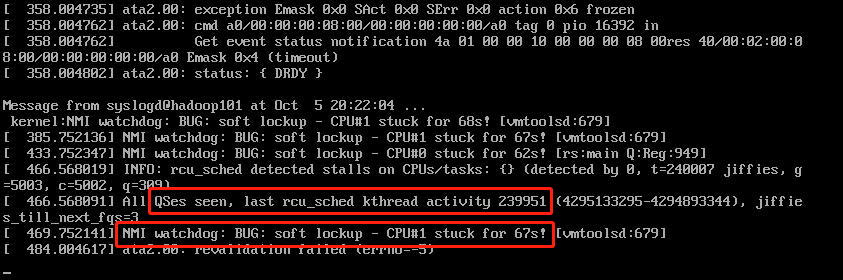
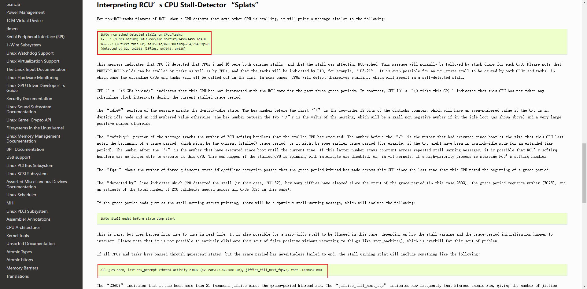
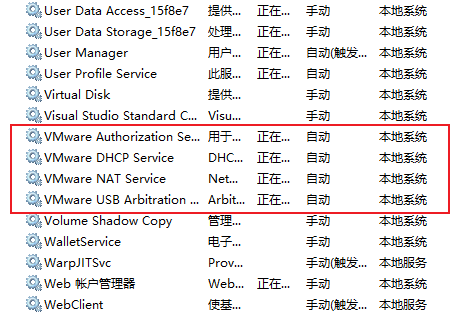

## Linux开机之后过一会儿自己进入死锁状态，然后CPU......嗯
真是个大坑，掉进去好几个小时，竟然这样解决了......呃呃呃

### 事情是这样的：
打开VMware，启动三台hadoop，结果开机之后每台都死锁，log如下：
​​​​​​    
``` shell
NMI watchdog: BUG: soft lockup -cpu#0 stuck for 22s!
```
打印上面这句话表示**发生了内核软锁死,linux中每个cpu都设置了一个watchdog进程来检测内存软锁的问题，如果进程进入死锁或者进入死循环，watchdog长时间得不到调度，系统检测到进程占用cpu的时间超出特定时间后，便打印此警告**。

``` shell
INFO: rcu_sched detecded stalls on cpus/tasks
```
打印上面这句话是**和RCU相关的,只知道RCU(Read-Copy Update)是Linux引入的一种新的锁机制**。

### 然而各种查文献资料，又是加内存，加CPU核，又是重启，balabala......,然而都无法解决。
​​​​​​ 

#### 最后这样解决了:
<font color=Red>把所有关于VMware的服务全部重启了一遍，终于解决！</font><br/>
​​​​​​ 

END...

